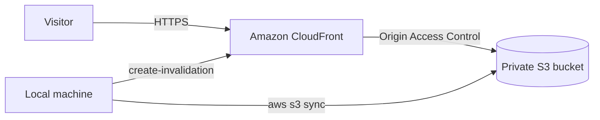

# Portfolio on AWS: S3 + CloudFront

A minimalist black-and-white personal portfolio, hand-written in HTML, CSS and vanilla JavaScript, and hosted on AWS as a secure static site.

**Live site:** https://patryk.is-a.dev

> Project 1 of my 10-project AWS learning path (preparing for AWS Certified Cloud Practitioner).

---

## Architecture



- **Amazon S3** stores the site files. The bucket is **private** (Block Public Access on), so it can't be read directly from the internet.
- **Amazon CloudFront** is the only way in. It reads from S3 through **Origin Access Control (OAC)**, serves the site over **HTTPS**, and caches content at edge locations for fast loading.
- **IAM:** daily work is done with an IAM user protected by MFA, never the root account.

## Features

- Responsive, high-contrast B&W design with a Geist font
- Animated network-style background drawn on `<canvas>`, reacting to the cursor
- Respects `prefers-reduced-motion` for accessibility
- No frameworks and no build step

## Tech stack

| Area | Tools |
|------|-------|
| Frontend | HTML5, CSS3, JavaScript (ES6+) |
| Hosting | Amazon S3, Amazon CloudFront (OAC, HTTPS) |
| Access control | IAM user with MFA, S3 bucket policy |
| Deployment | AWS CLI, Git and GitHub |

## Deployment

Sync the local folder to the bucket, then clear the CloudFront cache so changes appear immediately:

```bash
aws s3 sync . s3://aws-portfolio-patryk/ --delete
aws cloudfront create-invalidation --distribution-id <DISTRIBUTION_ID> --paths "/*"
```

Run the sync from the site folder only. `--delete` removes bucket files that don't exist locally.

## Cost

Designed to stay within the AWS free tier: a small static site on S3 plus CloudFront at low traffic costs next to nothing. AWS Budgets alerts are enabled as a safety net.

## What I learned (exam topics)

- Shared responsibility model: AWS secures the cloud, I secure what I put in it
- IAM best practices: no root for daily use, MFA, separate admin user
- S3 storage, bucket policies and why private buckets are safer
- CloudFront: edge locations, caching, invalidations, OAC and HTTPS
- Deploying with the AWS CLI

## Next steps

- Replace admin permissions with a least-privilege IAM policy (Project 2)
- Add a custom domain with Route 53 and ACM
- Automate deployment with GitHub Actions and Infrastructure as Code
